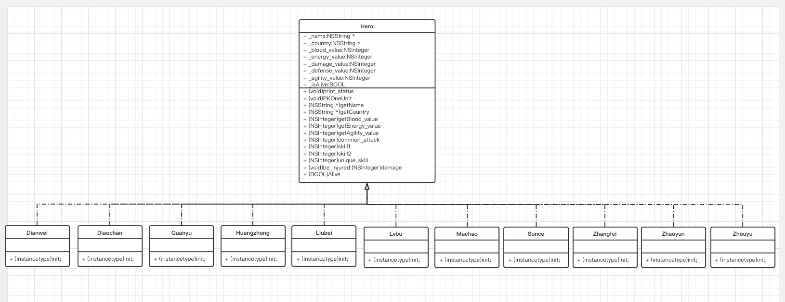
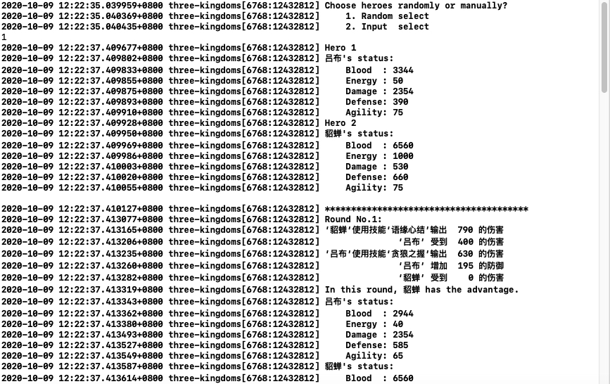
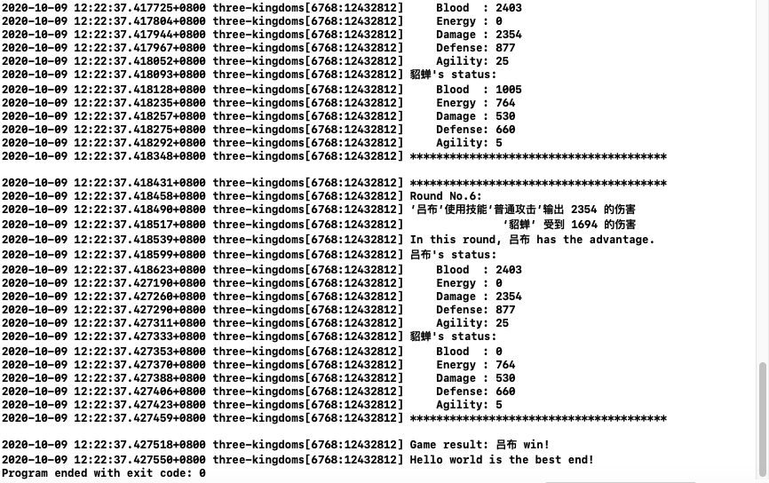
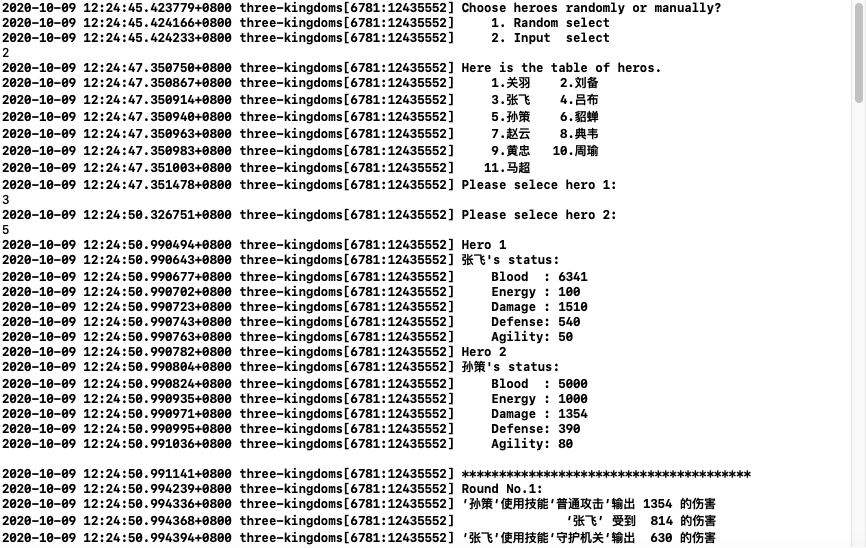
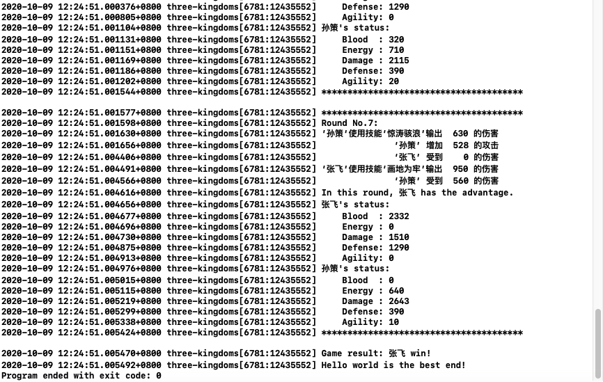

#  MOSAD HW1 实验报告

## 实验介绍

### 实验目的

* 熟悉 Mac OS 系统
* 熟悉 Xcode 项目结构
* 学习 Objective-C 语法

### 实验简介

设计N（N>10）个三国英雄。实现场景输出：随机选择两名英雄，挑战M（M<=10）个回合，其中每个回合各英雄可发动不同技能，从而导致不同的结果发生（英雄各属性变化及每个回合的输赢）。

### 实验要求

* 输出随机选择的英雄及其关键属性，输出单挑中每回合的过程、结果，以及最终胜负结果
* 现的oo特性（数据隐秘性、封装性、继承、多态）
* 类与类之间的继承关系与多态的体现


## 实验环境

操作系统：`macOS Catalina 10.15.7 `

IDE：`Xcode:12.0 (17219)`

## 实验设计

### 继承

本项目中实现了基类 Hero，其他英雄类均继承了 Hero 类

```objective-c
@interface Hero : NSObject {
    NSString *_name;
    NSString *_country;
    NSInteger _blood_value;
    NSInteger _energy_value;
    NSInteger _damage_value;
    NSInteger _defense_value;
    NSInteger _agility_value;
    BOOL _isAlive;
}
- (void)print_status;
- (void)PKOneUnit;
- (NSString *)getName;
- (NSString *)getCountry;
- (NSInteger)getBlood_value;
- (NSInteger)getEnergy_value;
- (NSInteger)getAgility_value;
- (NSInteger)common_attack;
- (NSInteger)skill1;
- (NSInteger)skill2;
- (NSInteger)unique_skill;
- (void)be_injured:(NSInteger)damage;
- (BOOL)Alive;
@end
  
@interface Liubei : Hero {
    
}
- (instancetype)init;
@end
```

### 多态

本项目中，主要在 main.m 文件中体现出了多态。

项目中，英雄对象设计成 Hero* 类型，通过 new 子类的方法来具体实现英雄。main.m 文件中函数的参数也采用了 Hero.m 类型。

```objective-c
Hero *selectHero(int n) {
    Hero *h;
    switch (n) {
        case 1:
            h = [Guanyu new];
            break;
        case 2:
            h = [Liubei new];
            break;
        // ... ...
        default:
            h = [Machao new];
            break;
    }
    return h;
}
void PK(Hero *h1, Hero *h2) {
    NSLog(@"Hero 1");
    [h1 print_status];
    NSLog(@"Hero 2");
    [h2 print_status];
    for (int i = 0; i < 10; ++i) {
        putchar(10);
        NSLog(@"***************************************");
        NSLog(@"Round No.%d:", i + 1);
        pkround(h1, h2);
        [h1 print_status];
        [h2 print_status];
        NSLog(@"***************************************");
        if (!([h1 Alive] && [h2 Alive]))
            break;
    }
    putchar(10);
    if ([h1 getBlood_value] > [h2 getBlood_value]) {
        NSLog(@"Game result: %@ win!", [h1 getName]);
    } else if ([h1 getBlood_value] < [h2 getBlood_value]) {
        NSLog(@"Game result: %@ win!", [h2 getName]);
    } else {
        NSLog(@"The game has drawn.!");
    }
}
```


### 英雄

> 本次实验的英雄技能和属性参考了 [王者荣耀](https://pvp.qq.com/web201605/herolist.shtml) 中的英雄数据。

#### 属性

* 生命值

  生命值即血条，表面英雄存活状态

* 攻击值

  英雄的攻击了，普通攻击回输出该攻击值，技能攻击会不同程度地利用该攻击值

* 防御值

  英雄收到攻击后，防御值可以抵挡部分伤害值，损失的生命值为伤害值减去防御值。

* 能量值

  英雄使用技能攻击需要消耗能量，如果能量为零，则英雄只可以发起普通攻击。

* 灵敏度

  灵敏度确定了在回合之中哪个英雄先发起攻击，灵敏度会随着技能攻击的发起而适当发生变化。

* 其他属性
  * 名字
  * 国家
  * 是否活着

```objective-c
@interface Hero : NSObject {
    NSString *_name;
    NSString *_country;
    NSInteger _blood_value;
    NSInteger _energy_value;
    NSInteger _damage_value;
    NSInteger _defense_value;
    NSInteger _agility_value;
    BOOL _isAlive;
}
```

| _name | _country | _blood_value | _energy_value | _damage_value | _defense_value | _agility_value |
| ----- | -------- | ------------ | ------------- | ------------- | -------------- | -------------- |
| 典韦  | 魏国     | 5500         | 1600          | 2200          | 125            | 60             |
| 貂蝉  | 中立     | 6560         | 1000          | 530           | 660            | 75             |
| 关羽  | 蜀国     | 4383         | 0             | 3000          | 400            | 60             |
| 黄忠  | 蜀国     | 6030         | 1784          | 1300          | 560            | 40             |
| 孙策  | 吴国     | 5000         | 1000          | 1354          | 390            | 80             |
| 刘备  | 蜀国     | 4300         | 750           | 654           | 890            | 70             |
| 吕布  | 中立     | 3344         | 50            | 2354          | 390            | 75             |
| 马超  | 蜀国     | 6610         | 650           | 2000          | 200            | 55             |
| 张飞  | 蜀国     | 6341         | 100           | 1510          | 540            | 50             |
| 赵云  | 蜀国     | 4300         | 500           | 1154          | 890            | 70             |
| 周瑜  | 吴国     | 5513         | 1970          | 900           | 500            | 75             |

#### 攻击

英雄的攻击分为 普通攻击 和 技能攻击

普通攻击即直接输出该英雄的攻击值，普通攻击不消耗能量

```objective-c
- (NSInteger)common_attack {
    NSLog(@"’%@‘使用技能‘普通攻击’输出 %4ld 的伤害", _name, _damage_value);
    return _damage_value;
}
```

技能攻击每个英雄都有三个，分别是一技能、二技能、必杀技

技能攻击消耗能量，不同英雄不同技能消耗的能量值不同（存在某些英雄所有技能都不消耗能量）。

技能攻击后会损失一定的灵敏度。

技能攻击有以下几种

* 输出固定伤害

  如 ‘张飞’ 的一技能 ‘画地为牢’

  ```objective-c
  - (NSInteger)skill1 {
      int consume = 10;
      if (_energy_value < consume)
          return -1;
      int hurt = 950;
      NSLog(@"’%@‘使用技能‘画地为牢’输出 %4d 的伤害", _name, hurt);
      _energy_value -= consume;
      if (_agility_value >= 10) {
          _agility_value -= 10;
      } else {
          _agility_value = 0;
      }
      return hurt;
  }
  ```

* 输出固定伤害加一定比例的攻击值

  如 ‘马超’ 的一技能 ‘萧索之刃‘

  ```objective-c
  - (NSInteger)skill1 {
      int consume = 30;
      if (_energy_value < consume)
          return -1;
      int hurt = 400 + 0.6 * _damage_value;
      NSLog(@"’%@‘使用技能‘萧索之刃’输出 %4d 的伤害", _name, hurt);
      _energy_value -= consume;
      if (_agility_value >= 10) {
          _agility_value -= 10;
      } else {
          _agility_value = 0;
      }
      return hurt;
  }
  ```

* 输出伤害后增加自身攻击

  如 ’黄忠‘ 的一技能 ‘追击潜能’

  ```objective-c
  - (NSInteger)skill1 {
      int consume = 50;
      if (_energy_value < consume)
          return -1;
      int hurt = 100;
      int cure = 90;
      NSLog(@"’%@‘使用技能‘追击潜能’输出 %4d 的伤害", _name, hurt);
      NSLog(@"              ‘%@’ 增加 %4d 的攻击", _name, cure);
      _damage_value += cure;
      _energy_value -= consume;
      if (_agility_value >= 10) {
          _agility_value -= 10;
      } else {
          _agility_value = 0;
      }
      return hurt;
  }
  ```

* 输出伤害后增强自身防御

  如 ‘吕布’ 的二技能 ‘贪狼之握’

  ```objective-c
  - (NSInteger)skill2 {
      int consume = 10;
      if (_energy_value < consume)
          return -1;
      int hurt = 630;
      int cure = _defense_value * 0.5;
      NSLog(@"’%@‘使用技能‘贪狼之握’输出 %4d 的伤害", _name, hurt);
      NSLog(@"              ‘%@’ 增加 %4d 的防御", _name, cure);
      _defense_value += cure;
      _energy_value -= consume;
      if (_agility_value >= 10) {
          _agility_value -= 10;
      } else {
          _agility_value = 0;
      }
      return hurt;
  }
  ```

* 输出伤害后增强自身灵敏度

  如 ‘刘备’ 的一技能 ‘双重射击‘

  ```objective-c
  - (NSInteger)skill1 {
      int consume = 60;
      if (_energy_value < consume)
          return -1;
      int hurt = 750;
      int cure = _agility_value * 0.3;
      NSLog(@"’%@‘使用技能‘双重射击’输出 %4d 的伤害", _name, hurt);
      NSLog(@"              ‘%@’ 增加 %4d 的灵敏", _name, cure);
      _agility_value += cure;
      _energy_value -= consume;
      if (_agility_value >= 10) {
          _agility_value -= 10;
      } else {
          _agility_value = 0;
      }
      return hurt;
  }
  ```

* 输出伤害后，产生嗜血效果

  如 ‘赵云’ 的二技能 ‘破云之龙’

  ```objective-c
  - (NSInteger)skill2 {
      int consume = 80;
      if (_energy_value < consume)
          return -1;
      NSInteger hurt = 175 + _damage_value * 0.4;
      int cure = hurt * 0.2;
      NSLog(@"’%@‘使用技能‘破云之龙’输出 %4ld 的伤害", _name, hurt);
      NSLog(@"              ‘%@’ 增加 %4d 的生命", _name, cure);
      _blood_value += cure;
      _energy_value -= consume;
      if (_agility_value >= 10) {
          _agility_value -= 10;
      } else {
          _agility_value = 0;
      }
      return hurt;
  }
  ```

### UML




## 具体实现

### 英雄基类

* get 方法

  各个 get 方法直接返回相应的属性值。

* 攻击

  在 Hero 中只是简单实现了普通攻击函数，技能攻击函数在派生类中都会重新实现后覆盖。

  ```objective-c
  - (NSInteger)common_attack {
      NSLog(@"’%@‘使用技能‘普通攻击’输出 %4ld 的伤害", _name, _damage_value);
      return _damage_value;
  }
  - (NSInteger)skill1 {
      NSLog(@"’%@‘使用技能‘第一技能’输出 %4ld 的伤害", _name, _damage_value);
      return _damage_value;
  }
  - (NSInteger)skill2 {
      NSLog(@"’%@‘使用技能‘第二技能’输出 %4ld 的伤害", _name, _damage_value);
      return _damage_value;
  }
  - (NSInteger)unique_skill {
      NSLog(@"’%@‘使用大招‘终极必杀’输出 %4ld 的伤害", _name, _damage_value);
      return _damage_value;
  }
  ```

* 受伤

  英雄收到的伤害需要减去防御值并且打印出信息。

  ```objective-c
  - (void)be_injured:(NSInteger)damage {
      NSInteger hurt = 0;
      if (damage > _defense_value) {
          hurt = damage - _defense_value;
      }
      NSLog(@"              ‘%@’ 受到 %4ld 的伤害", _name, hurt);
      if (hurt >= _blood_value) {
          _blood_value = 0;
          _isAlive = NO;
      } else {
          _blood_value -= hurt;
      }
  }
  ```

* 打印信息

  在屏幕中输出英雄的各种属性信息。

  ```objective-c
  - (void)print_status {
      NSLog(@"%@'s status:", _name);
      NSLog(@"    Blood  : %ld", _blood_value);
      NSLog(@"    Energy : %ld", _energy_value);
      NSLog(@"    Damage : %ld", _damage_value);
      NSLog(@"    Defense: %ld", _defense_value);
      NSLog(@"    Agility: %ld", _agility_value);
  }
  ```

### 英雄派生类

以英雄 ‘马超’ 为例

* 构造函数

  构造函数需要初始化英雄的各种属性。

  ```objective-c
  - (instancetype)init {
      self = [super init];
      if (self) {
          _name = @"马超";
          _country = @"蜀国";
          _blood_value = 6610;
          _energy_value = 650;
          _damage_value = 2000;
          _defense_value = 200;
          _agility_value = 55;
          _isAlive = YES;
      }
      return self;
  }
  ```

* 技能攻击函数

  每个英雄的三个技能均不相同，需要为每个英雄实现独特的技能攻击函数。

  一技能

  ```objective-c
  - (NSInteger)skill1 {
      int consume = 30;
      if (_energy_value < consume)
          return -1;
      int hurt = 400 + 0.6 * _damage_value;
      NSLog(@"’%@‘使用技能‘萧索之刃’输出 %4d 的伤害", _name, hurt);
      _energy_value -= consume;
      if (_agility_value >= 10) {
          _agility_value -= 10;
      } else {
          _agility_value = 0;
      }
      return hurt;
  }
  ```

  

  二技能

  ```objective-c
  - (NSInteger)skill2 {
      int consume = 40;
      if (_energy_value < consume)
          return -1;
      int hurt = 300 + 0.5 * _damage_value;
      int cure = 10;
      NSLog(@"’%@‘使用技能‘日落孤枪’输出 %4d 的伤害", _name, hurt);
      NSLog(@"              ‘%@’ 增加 %4d 的灵敏", _name, cure);
      _agility_value += cure;
      _energy_value -= consume;
      if (_agility_value >= 10) {
          _agility_value -= 10;
      } else {
          _agility_value = 0;
      }
      return hurt;
  }
  ```

  必杀技

  ```objective-c
  - (NSInteger)unique_skill {
      int consume = 50;
      if (_energy_value < consume)
          return -1;
      int hurt = 800 + 0.7 * _damage_value;
      NSLog(@"’%@‘使用技能‘万刃归鞘’输出 %4d 的伤害", _name, hurt);
      _energy_value -= consume;
      if (_agility_value >= 30) {
          _agility_value -= 30;
      } else {
          _agility_value = 0;
      }
      return hurt;
  }
  ```

### main.m 文件函数

```objective-c
NSInteger attack_by(Hero *h);
void pkround(Hero *h1, Hero *h2);
void PK(Hero *h1, Hero *h2);
Hero *selectHero(int n);
void randomSelect(void);
void inputSelect(void);
```

* main 函数

  根据提示，引导用户选择 随机生成英雄 还是 输入挑选英雄。

  ```objective-c
  int main(int argc, const char * argv[]) {
      @autoreleasepool {
          NSLog(@"Choose heroes randomly or manually?");
          NSLog(@"    1. Random select");
          NSLog(@"    2. Input  select");
          int n = 0;
          scanf("%d", &n);
          n = n % 2;
          if (n == 1) {
              randomSelect();
          } else {
              inputSelect();
          }
          NSLog(@"Hello world is the best end!");
      }
      return 0;
  }
  ```

* attack_by

  输入英雄的指针，返回英雄的输出伤害。

  利用 do-while 循环，实现了能量值限制判断。

  ```objective-c
  NSInteger attack_by(Hero *h) {
      int x = 0;
      NSInteger hurt = 0;
      do {
          x = arc4random() % 4;
          switch (x) {
              case 1:
                  hurt = [h skill1];
                  break;
              case 2:
                  hurt = [h skill2];
                  break;
              case 3:
                  hurt = [h unique_skill];
                  break;
              default:
                  hurt = [h common_attack];
                  break;
          }
      } while (hurt == -1);
      return hurt;
  }
  ```

* pkround

  根据双方英雄的灵敏度，判断哪一方英雄先发起攻击，之后另一方也发起攻击。

  ```objective-c
  void pkround(Hero *h1, Hero *h2) {
      if ([h1 getAgility_value] > [h2 getAgility_value]) {
          [h2 be_injured:attack_by(h1)];
          if ([h2 Alive]) {
              [h1 be_injured:attack_by(h2)];
          }
      } else {
          [h1 be_injured:attack_by(h2)];
          if ([h1 Alive]) {
              [h2 be_injured:attack_by(h1)];
          }
      }
  }
  ```

* PK

  打印所选英雄的属性信息，开始 10 回合的 PK，如果中途有英雄死亡，则跳出回合循环，最后打印游戏结果。

  ```objective-c
  void PK(Hero *h1, Hero *h2) {
      NSLog(@"Hero 1");
      [h1 print_status];
      NSLog(@"Hero 2");
      [h2 print_status];
      for (int i = 0; i < 10; ++i) {
          putchar(10);
          NSLog(@"***************************************");
          NSLog(@"Round No.%d:", i + 1);
          pkround(h1, h2);
          [h1 print_status];
          [h2 print_status];
          NSLog(@"***************************************");
          if (!([h1 Alive] && [h2 Alive]))
              break;
      }
      putchar(10);
      if ([h1 getBlood_value] > [h2 getBlood_value]) {
          NSLog(@"Game result: %@ win!", [h1 getName]);
      } else if ([h1 getBlood_value] < [h2 getBlood_value]) {
          NSLog(@"Game result: %@ win!", [h2 getName]);
      } else {
          NSLog(@"The game has drawn.!");
      }
  }
  ```

* selectHero

  输入英雄的编号，创建好相应英雄后，输出相应英雄的指针。

  ```objective-c
  Hero *selectHero(int n) {
      Hero *h;
      switch (n) {
          case 1:
              h = [Guanyu new];
              break;
          case 2:
              h = [Liubei new];
              break;
          case 3:
              h = [Zhangfei new];
              break;
          case 4:
              h = [Lvbu new];
              break;
          case 5:
              h = [Suice new];
              break;
          case 6:
              h = [Diaochan new];
              break;
          case 7:
              h = [Zhaoyun new];
              break;
          case 8:
              h = [Dianwei new];
              break;
          case 9:
              h = [Huangzhong new];
              break;
          case 10:
              h = [Zhouyu new];
              break;
          default:
              h = [Machao new];
              break;
      }
      return h;
  }
  ```

* randomSelect

  生成两个不同的随机数，根据随机数创建英雄，双方英雄进行 PK。

  ```objective-c
  void randomSelect(void) {
      int n1 = arc4random() % NUM_HEROS;
      int n2 = arc4random() % NUM_HEROS;
      while (n2 == n1) {
          n2 = arc4random() % NUM_HEROS;
      }
      Hero *h1 = selectHero(n1);
      Hero *h2 = selectHero(n2);
      PK(h1, h2);
  }
  ```

* inputSelect

  输出提示语，输入两个不同的英雄编号，双方英雄进行 PK。

  ```objective-c
  void inputSelect(void) {
      int n1 = 0, n2 = 0;
      NSLog(@"Here is the table of heros.");
      NSLog(@"    1.关羽    2.刘备");
      NSLog(@"    3.张飞    4.吕布");
      NSLog(@"    5.孙策    6.貂蝉");
      NSLog(@"    7.赵云    8.典韦");
      NSLog(@"    9.黄忠   10.周瑜");
      NSLog(@"   11.马超");
      NSLog(@"Please selece hero 1:");
      scanf("%d", &n1);
      NSLog(@"Please selece hero 2:");
      scanf("%d", &n2);
      while (n1 == n2) {
          NSLog(@"Please re selece another hero:");
          scanf("%d", &n2);
      }
      Hero *h1 = selectHero(n1 % NUM_HEROS);
      Hero *h2 = selectHero(n2 % NUM_HEROS);
      PK(h1, h2);
  }
  ```

## 测试运行

* 系统随机选择英雄





* 用户输入选择英雄





## 实验总结

这次实验使我

* 熟悉了 macOS 操作系统和 Xcode 的基本使用方法；
* 深入学习了 Objective-c 语言的语法相关知识；
* 进一步学习了面向对象语言中继承和多态的相关知识；
* 熟悉了 Gitee 以及 Git 的基本使用操作；
* 体会了游戏中各个英雄属性相互之间的制约平衡关系。

